# NFS The Run DualShock Controller Assets

This is a set of replacement textures for NFS The Run to switch from XBox to PS/DualShock style
controller buttons. 

These have been drawn to match the original assets from the PS3 version of the game - they're
not perfect, but not bad either.

## Images

Menu buttons:

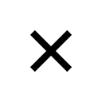
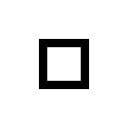
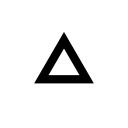
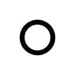

QTE Buttons

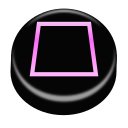
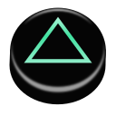

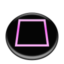
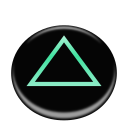
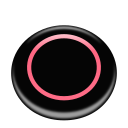

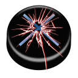
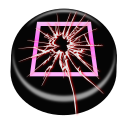
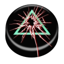
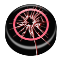

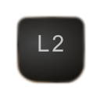
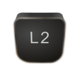
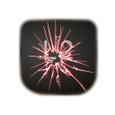

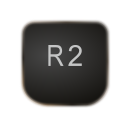
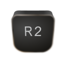
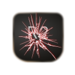

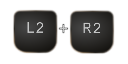
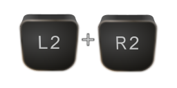
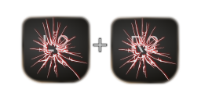

## What's What?

* `dump/` - various assets as dumped from the game
* `exported/` - assets in PNG format as exported from Inkscape
* `inject/dualshock/` - PS DualShock controller assets
* `inject/characters/` - upscale character assets for loading screens
* `inject/menu/` - criper menu assets
* `manual-edit/` - manually edit sprite sheets
* `reference/` - various screen grabs from video walkthroughs of the game on PS3
* `buttons.svg` - contains the redrawn assets.  Layer's need to be shown/hidden to configure each button
* `convert.sh` - script to convert the .png files to .dds and rename with correct hash
* `menu-arrows.svg` - the orange chevron arrow used in menus
* `menu-bar.svg` - the menu bar highlight
* `shoulder-button*.svg` - the L2/R2 buttons

## License

MIT &copy; 2026 Topten Software - see [LICENSE](./LICENSE) for details.

