# NFS The Run - Remastered Assets

This is a set of remastered assets for NFS The Run to be used with 
[Texture-Toolkit](https://github.com/BadassBaboon/Texture-Toolkit) and/or 
[NFS The Run Definitive Edition](https://nfsmods.xyz/mod/5373).

## Menu Arrows and Indicators

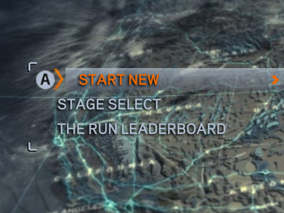
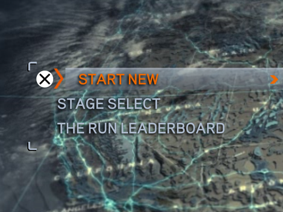

# Loading Maps

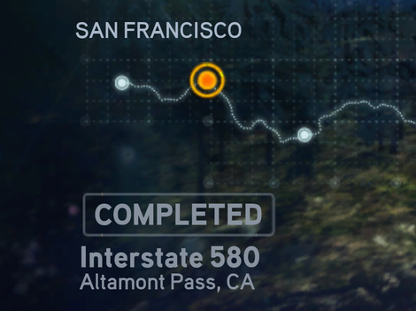
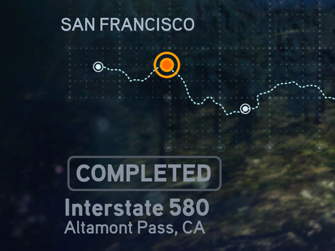

# Stage Maps

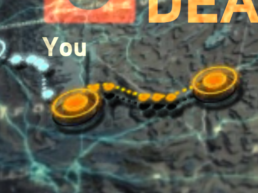
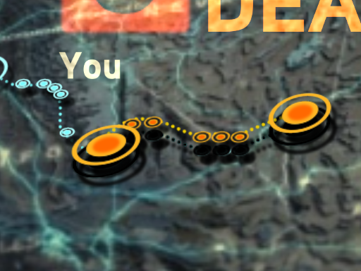

# Upscaled Characters

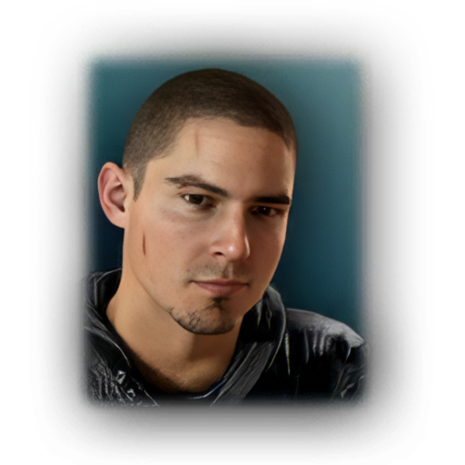

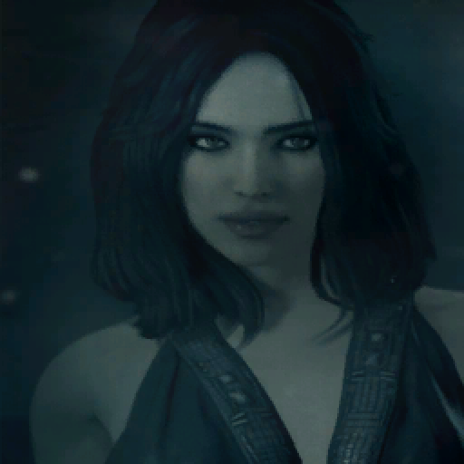

## HUD Map Arrows

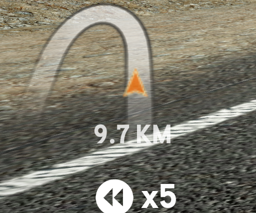

## DualShock Controller Assets

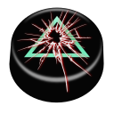
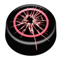

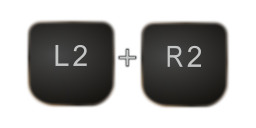
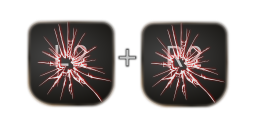

## License

MIT &copy; 2026 Topten Software - see [LICENSE](./LICENSE) for details.

